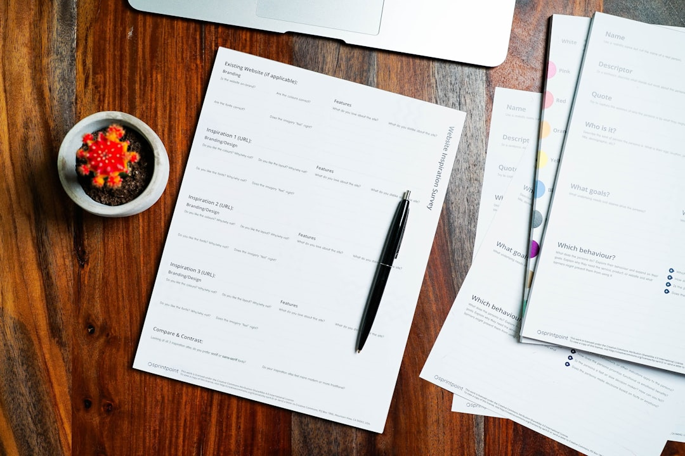

## 제목 후보
1. 제주 대부업체 이용 전 반드시 확인할 5가지 (등록번호 조회 방법)
2. 서귀포·제주 대부업체 등록번호 조회하는 법, 이용 전 체크리스트
3. 제주 대출 상담 전 확인할 것 5가지 (등록 대부업체 구별법)

## 태그 후보
#제주대부업 #등록대부업체 #서귀포대출 #제주대출 #대출체크리스트

## 대표이미지

사진: 2H Media on Unsplash (https://unsplash.com/@2hmedia)

## 본문

급하게 자금이 필요할 때일수록 어느 업체와 거래하는지 꼼꼼히 확인하는 것이 중요합니다. 등록되지 않은 불법 사금융 업체와의 거래는 법적 보호를 받기 어렵고, 이후 분쟁이 생겨도 구제받기 힘든 경우가 많기 때문인데요. 오늘은 대부업체를 이용하기 전에 반드시 확인해야 할 5가지를 정리해드리겠습니다.

## 1. 대부업 등록번호부터 확인하세요

가장 먼저, 가장 확실하게 확인할 수 있는 부분입니다.

정식으로 등록된 대부업체는 반드시 등록번호를 가지고 있습니다. "2024-제주제주-0025"처럼 연도와 지역, 일련번호로 구성된 형태인데요. 이 번호는 지자체(시·군·구) 홈페이지나 금융감독원 등의 경로를 통해 실제 등록 여부를 조회해볼 수 있습니다. 광고나 안내문에 등록번호가 아예 없다면 한 번 더 의심해보셔야 합니다.

## 2. 등록 유효기간이 살아있는지 확인하세요

대부업 등록은 일정 기간마다 갱신이 필요합니다. 등록번호가 있다고 해도 유효기간이 지났다면 문제가 될 수 있으므로, 상담 시 등록 유효기간까지 함께 확인해보시는 것이 안전합니다.

사진: Cytonn Photography on Unsplash (https://unsplash.com/@cytonn_photography)

## 3. 금리가 법정 최고금리 이내인지 확인하세요

대부업 대출의 금리는 법정 최고금리를 초과할 수 없습니다. 상담 과정에서 안내받는 금리가 이 범위 안에 있는지 반드시 확인하시고, 애매하게 설명하거나 정확한 금리를 알려주지 않는 곳이라면 주의가 필요합니다.

## 4. 사무실 주소와 연락처가 명확한지 확인하세요

정상적으로 운영되는 업체라면 실제 사무실 주소와 대표자, 연락처가 명확하게 공개되어 있습니다. 주소 없이 전화번호만 안내하거나, 소재지를 알려주지 않으려는 곳이라면 신중하게 접근하시는 것이 좋습니다.

전화번호만 있고 사무실 위치를 특정하기 어려운 경우, 문제가 생겼을 때 직접 찾아가 확인하거나 분쟁을 해결하기가 훨씬 어려워질 수 있습니다. 상담 전에 소재지를 먼저 확인해보는 습관을 들이는 것이 좋습니다.

## 5. 계약 전 조건을 문서로 확인하세요

구두 설명만 듣고 계약을 진행하기보다는, 금리·상환 방식·중도상환수수료 여부 등을 문서로 확인한 뒤 계약하는 것이 안전합니다. 궁금한 부분은 계약 전에 충분히 질문하고 답변을 받아두세요.

특히 상환 스케줄과 연체 시 적용되는 조건은 계약서에 명확히 기재되어야 하는 항목입니다. 서면으로 남지 않은 구두 약속은 나중에 분쟁이 생겼을 때 확인하기 어려우니, 반드시 문서로 남겨두시길 권해드립니다.

## 제주·서귀포 어디서든 확인하고 상담하세요

다모아캐피탈대부는 제주시와 서귀포시를 포함한 제주 전역에서 상담을 진행하며, 등록번호와 소재지 등 필요한 정보를 투명하게 안내해드리고 있습니다.

## 마무리

급할수록 한 번 더 확인하는 습관이 중요합니다. 위 5가지를 기준으로 삼으시면 불필요한 피해를 줄이고, 더 안전하게 상담을 진행하시는 데 도움이 될 거예요.

---

[대부업 안내]
상호: 다모아캐피탈대부 | 등록번호: 2024-제주제주-0025 | 대표자: 배영호
소재지: 제주특별자치도 제주시 월산북길 43-3, 제지하1층 제비104호 (도평동)
문의: 010-5950-2924
실제 적용금리: 연 20% (법정 최고금리 이내), 대출조건은 심사 결과에 따라 달라질 수 있습니다.
과도한 빚, 대출은 개인신용평점 하락의 원인이 될 수 있습니다.
본 게시물은 정보 제공을 목적으로 하며, 실제 대출 조건은 상담을 통해 확인하시기 바랍니다.

홈페이지: https://다모아캐피탈.com/
