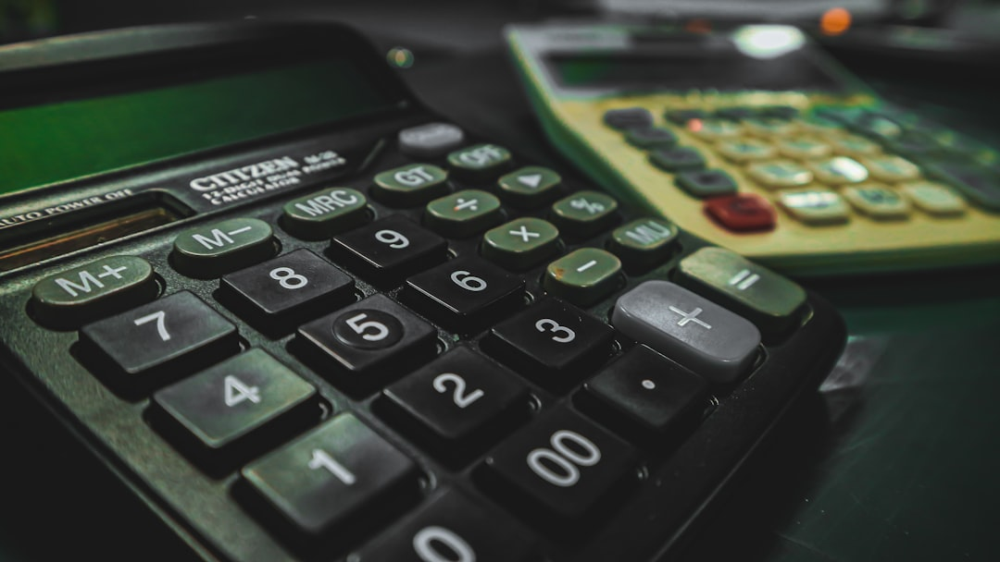

## 제목 후보
1. 법정 최고금리란 무엇인가요? (제주 대출 상담 전 필수 상식)
2. 제주 대출 상담 전 알아야 할 법정 최고금리 개념
3. 법정 최고금리, 서귀포·제주 대출 이용 전 꼭 확인하세요

## 태그 후보
#법정최고금리 #제주대출 #서귀포대출 #제주신용대출 #제주대부업

## 대표이미지

사진: iSawRed on Unsplash (https://unsplash.com/@isawred)

## 본문

대출 상담을 받다 보면 "법정 최고금리"라는 말을 자주 듣게 됩니다. 정확히 어떤 의미인지 모른 채 넘어가는 경우가 많은데, 오늘은 이 개념을 명확하게 정리해드리겠습니다. 대출을 이용하기 전 꼭 알아두면 좋은 기본 상식이니 끝까지 읽어보시길 권해드립니다.

## 법정 최고금리란?

법정 최고금리는 대부업체를 포함한 금융기관이 대출 시 적용할 수 있는 금리의 법적 상한선을 의미합니다. 이 상한선을 초과하는 금리는 법적으로 허용되지 않으며, 대부업체는 이 범위 안에서만 금리를 책정할 수 있습니다.

즉, 어떤 대부업체와 거래하더라도 법정 최고금리를 넘는 이자를 요구할 수 없다는 뜻입니다. 만약 이를 초과하는 금리를 안내받으셨다면, 등록된 정상 업체인지부터 다시 확인해보셔야 합니다. 이는 대출 이용자를 과도한 이자 부담으로부터 보호하기 위해 마련된 제도입니다.

사진: Tingey Injury Law Firm on Unsplash (https://unsplash.com/@tingeyinjurylawfirm)

## 왜 이 개념을 알아둬야 할까요?

법정 최고금리를 모른 채 상담을 받으면, 안내받은 금리가 적정한 수준인지 스스로 판단하기 어렵습니다. 반대로 이 개념을 알고 있으면, 상담 과정에서 제시되는 조건이 합리적인 범위 안에 있는지 스스로 점검해볼 수 있습니다.

또한 광고나 안내문에서 금리를 명확히 밝히지 않거나 애매하게 설명하는 업체는 한 번 더 의심해보시는 것이 좋습니다. 정상적으로 운영되는 업체라면 법정 최고금리 이내에서 정확한 금리를 안내하는 것이 원칙입니다.

간혹 "특별 조건"이나 "단기 할증" 같은 명목으로 실제 금리를 애매하게 안내하는 경우도 있는데, 이런 경우에도 최종적으로 적용되는 연 환산 금리가 법정 최고금리를 넘지 않는지 꼭 확인해보셔야 합니다.

## 실제 적용 금리는 어떻게 확인하나요?

실제 적용되는 금리는 개인의 신용 상태, 소득, 상환 능력 등 심사 결과에 따라 달라질 수 있습니다. 상담 시 정확한 금리 범위를 먼저 안내받고, 이 금리가 법정 최고금리 이내에 있는지 직접 확인해보시는 습관을 들이시길 권해드립니다. 같은 조건이라도 심사 시점에 따라 결과가 달라질 수 있다는 점도 참고해주세요.

- 상담 시 금리를 서면 또는 명확한 안내로 받기
- 법정 최고금리를 초과하지 않는지 확인하기
- 애매한 답변을 하는 곳은 한 번 더 검토하기
- 연 환산 기준으로 최종 금리를 다시 계산해보기

## 제주·서귀포 어디서든 확인하고 상담하세요

다모아캐피탈대부는 제주시와 서귀포시를 포함한 제주 전역에서 상담을 진행하며, 법정 최고금리 이내의 정확한 금리 정보를 투명하게 안내해드리고 있습니다.

## 마무리

법정 최고금리는 대출 이용자를 보호하기 위한 기본적인 안전장치입니다. 상담 전 이 개념을 알아두시면 더 안심하고 상담을 진행하실 수 있고, 불합리한 조건을 미리 걸러내는 데도 도움이 됩니다. 궁금한 점이 있다면 언제든 편하게 문의해주세요.

---

[대부업 안내]
상호: 다모아캐피탈대부 | 등록번호: 2024-제주제주-0025 | 대표자: 배영호
소재지: 제주특별자치도 제주시 월산북길 43-3, 제지하1층 제비104호 (도평동)
문의: 010-5950-2924
실제 적용금리: 연 20% (법정 최고금리 이내), 대출조건은 심사 결과에 따라 달라질 수 있습니다.
과도한 빚, 대출은 개인신용평점 하락의 원인이 될 수 있습니다.
본 게시물은 정보 제공을 목적으로 하며, 실제 대출 조건은 상담을 통해 확인하시기 바랍니다.

홈페이지: https://다모아캐피탈.com/
