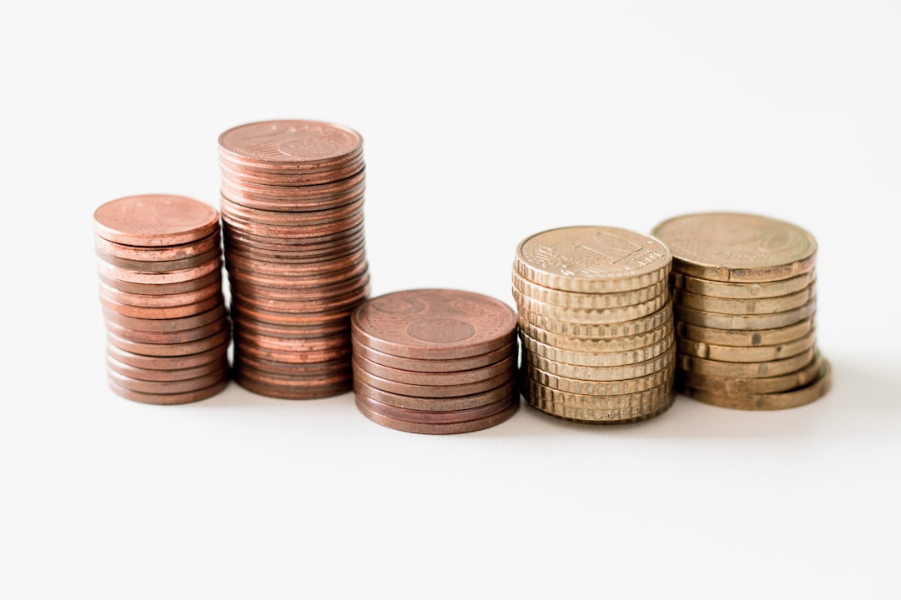

## 제목 후보
1. 중도상환수수료가 있나요? (제주 대출 FAQ)
2. 제주 대출 중도상환수수료, 미리 확인하세요 (FAQ)
3. 서귀포·제주 대출 상담 전 궁금한 중도상환수수료 FAQ

## 태그 후보
#중도상환수수료 #제주대출 #서귀포대출 #제주신용대출 #대출FAQ

## 대표이미지

사진: Ibrahim Rifath on Unsplash (https://unsplash.com/@ripey__)

## 본문

"대출금을 예정보다 빨리 갚으면 수수료가 붙나요?" 상담 과정에서 자주 나오는 질문 중 하나입니다. 중도상환수수료는 대출 조건에 따라 있을 수도, 없을 수도 있는 항목이라 미리 확인해두는 것이 중요합니다. 특히 목돈이 생겼을 때 대출을 조기에 정리하고 싶으신 분들이라면 더욱 궁금하실 텐데요, 오늘은 이 부분을 정리해드리겠습니다.

## 중도상환수수료란?

중도상환수수료는 대출 기간이 끝나기 전에 원금을 미리 갚을 때 부과될 수 있는 수수료를 의미합니다. 모든 대출에 일괄적으로 적용되는 것은 아니며, 상품과 계약 조건에 따라 부과 여부와 비율이 달라질 수 있습니다. 대출을 처음 실행할 당시의 계약 조건에 이미 명시되어 있는 경우가 많으므로, 계약서를 다시 한번 살펴보시는 것도 좋은 방법입니다.

빨리 갚는 것이 무조건 유리하다고 생각하실 수 있지만, 중도상환수수료가 있는 상품이라면 이 부분까지 함께 계산해보셔야 실제로 유리한지 판단할 수 있습니다. 절감되는 이자와 발생하는 수수료를 비교해본 뒤 상환 시점을 결정하시는 것이 합리적입니다.

사진: Towfiqu barbhuiya on Unsplash (https://unsplash.com/@towfiqu999999)

## 계약 전에 꼭 확인해야 할 이유

중도상환수수료 여부와 비율은 계약서에 명확히 기재되어야 하는 항목입니다. 구두로만 안내받고 넘어가면 나중에 예상치 못한 비용이 발생할 수 있으니, 계약 전에 반드시 문서로 확인하시길 권해드립니다. 애매하게 설명하거나 확인을 꺼리는 곳이라면 한 번 더 신중하게 검토해보시는 것이 좋습니다.

특히 상환 계획이 유동적이거나, 목돈이 생기면 조기 상환할 가능성이 있으신 분들은 이 부분을 더욱 꼼꼼히 짚어보시는 것이 좋습니다. 계약 시점에는 당장 필요하지 않아 보이는 조건이라도, 나중에 상황이 바뀌면 중요한 문제가 될 수 있습니다.

## 상담 시 이렇게 질문해보세요

- 이 상품에 중도상환수수료가 있나요?
- 있다면 비율은 어느 정도인가요?
- 일정 기간이 지나면 수수료가 면제되는 조건이 있나요?
- 일부 금액만 먼저 갚는 경우에도 수수료가 적용되나요?

이렇게 구체적으로 질문하시면 더 명확한 답변을 받으실 수 있고, 나중에 예상치 못한 비용으로 당황하는 상황도 미리 방지할 수 있습니다.

## 제주·서귀포 어디서든 상담 가능합니다

다모아캐피탈대부는 제주시와 서귀포시를 포함한 제주 전역에서 상담을 진행하며, 중도상환수수료를 포함한 계약 조건을 계약 전에 명확하게 안내해드리고 있습니다. 지역에 상관없이 궁금하신 사항은 언제든 편하게 문의하실 수 있습니다.

## 마무리

중도상환수수료는 상품마다 다를 수 있는 만큼, 계약 전에 미리 확인해두는 습관이 무엇보다 중요합니다. 작은 항목처럼 보여도 실제 상환 계획에는 꽤 큰 영향을 줄 수 있으니, 계약서를 꼼꼼히 읽어보시는 것도 잊지 마세요. 궁금한 점이 있다면 상담을 통해 정확하게 확인해보세요.

---

[대부업 안내]
상호: 다모아캐피탈대부 | 등록번호: 2024-제주제주-0025 | 대표자: 배영호
소재지: 제주특별자치도 제주시 월산북길 43-3, 제지하1층 제비104호 (도평동)
문의: 010-5950-2924
실제 적용금리: 연 20% (법정 최고금리 이내), 대출조건은 심사 결과에 따라 달라질 수 있습니다.
과도한 빚, 대출은 개인신용평점 하락의 원인이 될 수 있습니다.
본 게시물은 정보 제공을 목적으로 하며, 실제 대출 조건은 상담을 통해 확인하시기 바랍니다.

홈페이지: https://다모아캐피탈.com/
