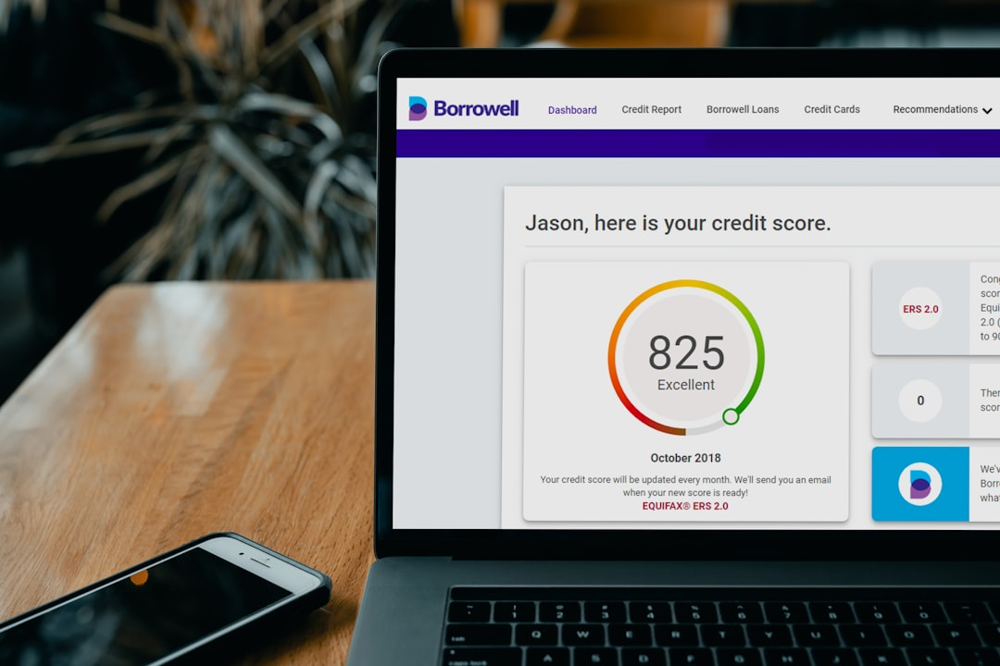
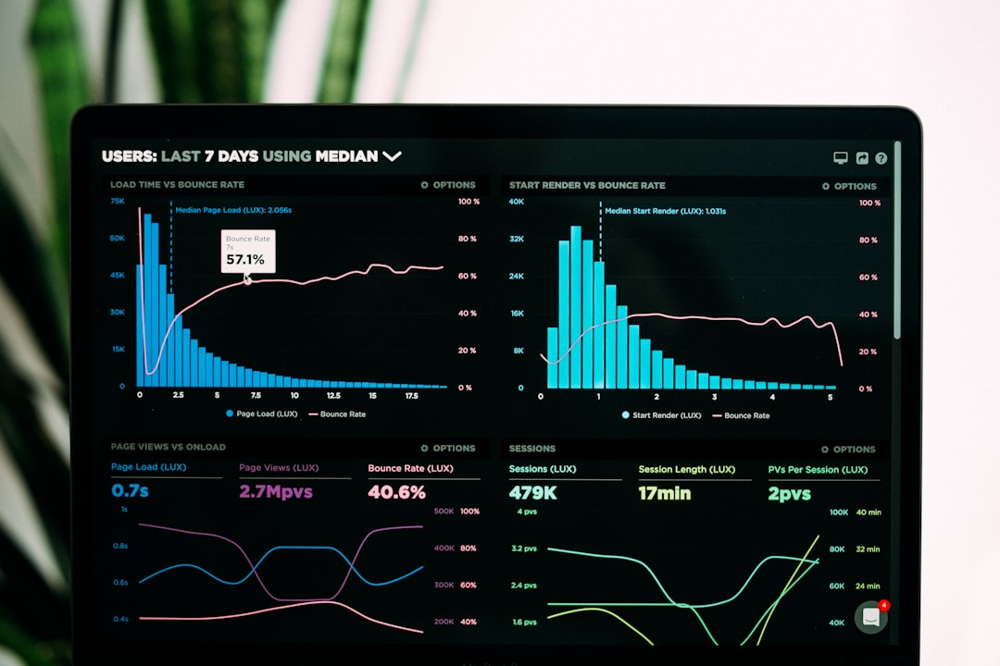

## 제목 후보
1. 신용점수는 어떻게 계산되나요? (제주 대출 상담 전 상식)
2. 제주 대출 전 알아두면 좋은 신용점수 계산 원리
3. 신용점수 계산 기준, 서귀포·제주 대출 상담 전 확인하세요

## 태그 후보
#신용점수 #신용점수계산 #제주대출 #서귀포대출 #제주신용대출

## 대표이미지

사진: PiggyBank on Unsplash (https://unsplash.com/@piggybank)

## 본문

대출 상담을 받다 보면 신용점수 이야기를 빼놓을 수 없습니다. 그런데 정작 이 점수가 어떤 기준으로 계산되는지는 잘 모르시는 분들이 많은데요. 막연히 "관리해야 한다"는 것은 알지만 구체적으로 무엇을 신경 써야 하는지 헷갈리시는 경우가 대부분입니다. 오늘은 신용점수가 어떤 요소들로 구성되는지 정리해드리겠습니다.

## 신용점수를 구성하는 주요 요소

신용점수는 하나의 지표만으로 결정되지 않고, 여러 요소를 종합적으로 반영해 산출됩니다. 각 요소가 서로 맞물려 점수에 영향을 주기 때문에, 한 부분만 신경 쓰기보다 전체적으로 균형 있게 관리하는 것이 중요합니다. 일반적으로 아래와 같은 항목들이 반영되는 것으로 알려져 있습니다.

- 상환 이력: 연체 없이 제때 갚아온 기록
- 부채 수준: 소득 대비 부채 비율, 신용카드 한도 대비 사용률
- 신용거래 기간: 금융 거래를 얼마나 오래, 꾸준히 유지해왔는지
- 신용 형태: 신용카드, 대출 등 다양한 금융 이용 이력
- 신규 신용 조회: 짧은 기간 내 반복적인 신청 여부

각 요소가 차지하는 비중은 평가 기관과 시점에 따라 달라질 수 있으므로, 정확한 산출 기준은 해당 기관을 통해 확인하시는 것이 가장 정확합니다. 여러 요소가 복합적으로 반영되는 만큼, 한 가지 항목만 관리한다고 점수가 크게 오르지는 않는다는 점도 함께 알아두시면 좋습니다.

사진: Luke Chesser on Unsplash (https://unsplash.com/@lukechesser)

## 상환 이력이 가장 중요한 이유

여러 요소 중에서도 상환 이력, 즉 연체 여부는 신용점수에 가장 직접적인 영향을 미치는 요소로 알려져 있습니다. 단 한 번의 연체라도 이력에 남을 수 있으니, 결제일 관리가 신용점수 관리의 기본이라고 할 수 있습니다. 자동이체를 걸어두거나 알림을 설정해두는 것만으로도 연체 위험을 크게 줄일 수 있습니다.

## 신용점수는 왜 대출 조건에 영향을 줄까요?

신용점수는 상환 능력을 가늠하는 지표로 활용되기 때문에, 대출 한도와 금리 조건을 결정하는 심사 과정에서 중요하게 고려됩니다. 점수가 높다고 해서 반드시 유리한 조건이 보장되는 것은 아니지만, 심사 과정에서 참고되는 주요 지표 중 하나인 것은 분명합니다. 소득이나 기존 부채 상황 등 다른 요소와 함께 종합적으로 판단된다는 점도 기억해두시면 좋습니다.

## 제주·서귀포에서도 신용점수 상담이 가능합니다

다모아캐피탈대부는 제주시와 서귀포시를 포함한 제주 전역에서 상담을 진행하며, 신용 상태에 따른 상담도 함께 안내해드리고 있습니다. 거주 지역과 상관없이 편하게 문의하실 수 있습니다.

## 마무리

신용점수는 여러 요소가 함께 작용해 만들어지는 결과입니다. 구성 요소를 이해하고 있으면, 평소 관리에도 도움이 되고 상담 과정도 한결 수월해질 수 있습니다. 하루아침에 바뀌는 지표가 아닌 만큼, 조급해하기보다 꾸준한 관리를 목표로 삼아보시길 권해드립니다. 궁금한 점이 있다면 상담을 통해 확인해보세요.

---

[대부업 안내]
상호: 다모아캐피탈대부 | 등록번호: 2024-제주제주-0025 | 대표자: 배영호
소재지: 제주특별자치도 제주시 월산북길 43-3, 제지하1층 제비104호 (도평동)
문의: 010-5950-2924
실제 적용금리: 연 20% (법정 최고금리 이내), 대출조건은 심사 결과에 따라 달라질 수 있습니다.
과도한 빚, 대출은 개인신용평점 하락의 원인이 될 수 있습니다.
본 게시물은 정보 제공을 목적으로 하며, 실제 대출 조건은 상담을 통해 확인하시기 바랍니다.

홈페이지: https://다모아캐피탈.com/
