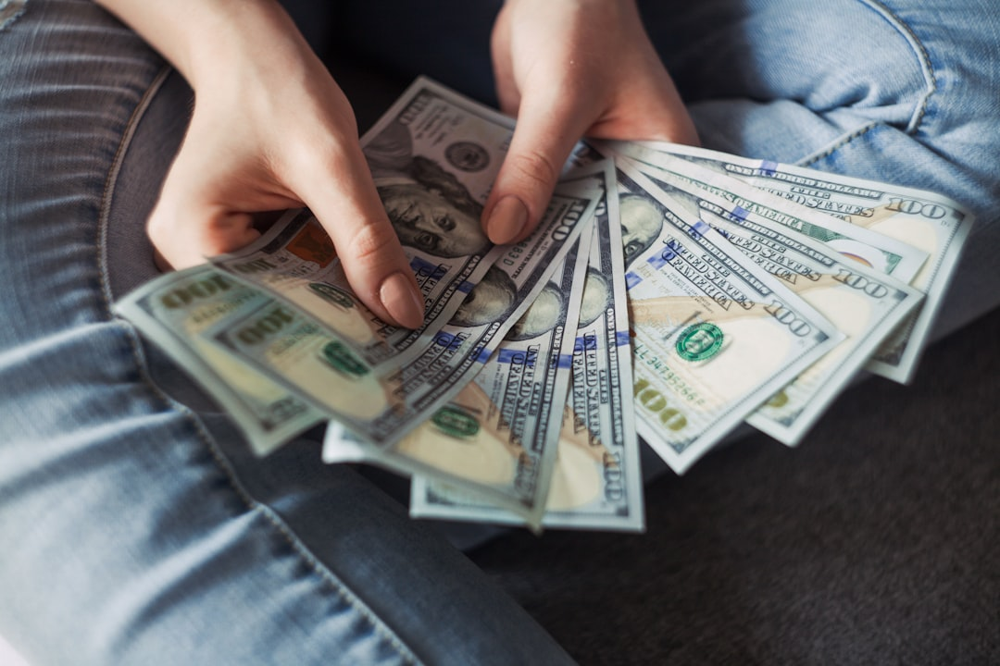
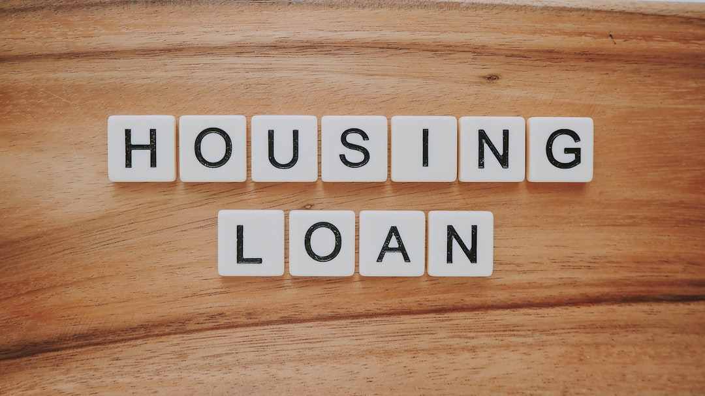

## 제목 후보
1. 대출 한도는 어떻게 결정되나요? (제주 대출 상담 필수 상식)
2. 제주 대출 한도 결정 요인, 소득·신용점수·DSR 정리
3. 서귀포·제주 대출 한도가 궁금하다면 꼭 알아야 할 3가지

## 태그 후보
#대출한도 #제주대출 #서귀포대출 #DSR #제주신용대출

## 대표이미지

사진: Alexander Mils on Unsplash (https://unsplash.com/@alexandermils)

## 본문

대출을 알아보실 때 가장 궁금하신 부분 중 하나가 바로 "얼마까지 빌릴 수 있는가"일 텐데요. 대출 한도는 단순히 원하는 금액을 말한다고 정해지는 것이 아니라, 여러 요소를 종합적으로 심사한 뒤 결정됩니다. 같은 소득이라도 사람마다 한도가 다르게 안내되는 이유가 바로 여기에 있습니다. 오늘은 대출 한도를 결정하는 주요 요인을 정리해드리겠습니다.

## 1. 소득 수준

소득은 상환 능력을 판단하는 가장 기본적인 지표입니다. 안정적인 소득이 확인될수록 심사 과정에서 긍정적으로 반영되는 경우가 많으며, 재직증명서나 소득금액증명원 등으로 소득을 증빙하게 됩니다. 프리랜서나 자영업자의 경우에도 소득 증빙 서류를 통해 심사가 진행되니, 관련 서류를 미리 준비해두시면 좋습니다.

## 2. 신용점수

신용점수는 그동안의 상환 이력과 신용 관리 상태를 보여주는 지표로, 대출 한도와 금리 조건에 함께 영향을 줄 수 있습니다. 신용점수가 낮다고 해서 대출 자체가 불가능한 것은 아니지만, 조건에 영향을 줄 수 있다는 점은 참고해두시면 좋습니다. 평소 연체 없이 관리해온 이력이 있다면 심사 과정에서 긍정적으로 작용할 수 있습니다.

사진: Precondo CA on Unsplash (https://unsplash.com/@precondo)

## 3. DSR(총부채원리금상환비율)

DSR(총부채원리금상환비율)은 소득 대비 전체 부채의 원리금 상환 비율을 의미합니다. 기존에 보유한 대출이 많을수록 DSR이 높아지고, 이는 추가 대출 한도에 영향을 줄 수 있습니다. 신규 대출을 고려하신다면 현재 DSR 수준을 먼저 점검해보시는 것이 좋습니다. 기존 대출을 정리하거나 상환 계획을 조정하는 것만으로도 DSR 수준이 달라질 수 있습니다.

## 이 외에도 고려되는 요소들

앞서 살펴본 소득, 신용점수, DSR은 대출 한도를 결정하는 데 핵심적인 역할을 하지만, 이것이 전부는 아닙니다. 상담 시 함께 검토되는 항목들도 미리 알아두시면 도움이 됩니다.

위 세 가지 외에도 재직 기간, 기존 연체 이력, 상환 계획의 구체성 등이 함께 검토될 수 있습니다. 같은 소득이라도 상황에 따라 실제 한도는 다르게 안내될 수 있으므로, 정확한 한도는 상담을 통해 확인하시는 것이 가장 정확합니다. 여러 요소를 미리 점검해두시면 상담 시 더 구체적인 안내를 받으실 수 있습니다.

## 제주·서귀포 어디서든 상담 가능합니다

다모아캐피탈대부는 제주시와 서귀포시를 포함한 제주 전역에서 상담을 진행하며, 개인 상황에 맞는 한도 안내를 도와드리고 있습니다. 취급 가능한 금액 범위는 상담을 통해 정확히 확인하실 수 있으며, 거주 지역과 상관없이 문의하실 수 있습니다.

## 마무리

대출 한도는 소득, 신용점수, DSR 등이 종합적으로 반영되어 결정됩니다. 미리 본인의 상황을 점검해두시면 상담이 한결 수월하게 진행될 수 있습니다. 정확한 한도는 서류와 심사 결과에 따라 달라지니, 궁금한 점이 있다면 편하게 문의해주세요.

---

[대부업 안내]
상호: 다모아캐피탈대부 | 등록번호: 2024-제주제주-0025 | 대표자: 배영호
소재지: 제주특별자치도 제주시 월산북길 43-3, 제지하1층 제비104호 (도평동)
문의: 010-5950-2924
실제 적용금리: 연 20% (법정 최고금리 이내), 대출조건은 심사 결과에 따라 달라질 수 있습니다.
과도한 빚, 대출은 개인신용평점 하락의 원인이 될 수 있습니다.
본 게시물은 정보 제공을 목적으로 하며, 실제 대출 조건은 상담을 통해 확인하시기 바랍니다.

홈페이지: https://다모아캐피탈.com/
